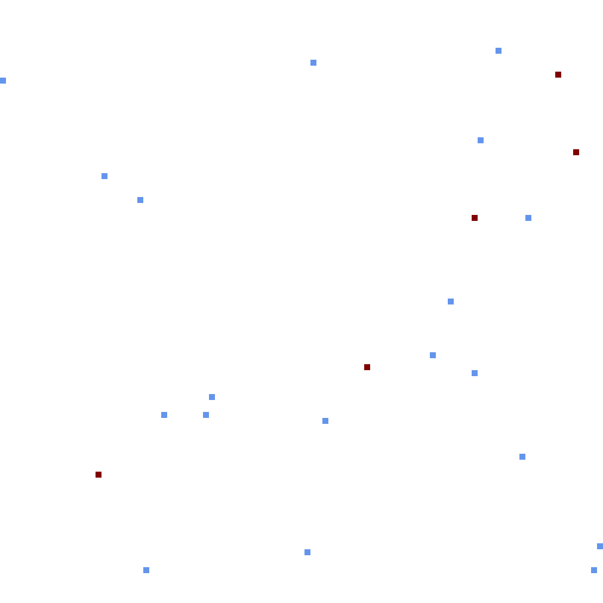

# uekat-studies-io-project
Uniwersytet Ekonimiczny in Katowice - project for the subject "Inteligencja obliczeniowa"

## Usage

Call the program from the terminal, giving it as an argument an integer that will provide the seed for the random generation of the transport problem to be solved.
The program will output as text the algorithm's steps and final solution as well as produce an image file named `output.png`, showing a map of the generated world, with warehouses marked as maroon squares and the customers' stores cornflower blue.

```
$ dotnet run -- 404
```

## Example output for the seed 404

```
Generating map with seed 404...
Warehouse #1: (79, 36)
(...)
Warehouse #5: (96, 25)
Store #1: (88, 36)
(...)
Store #19: (52, 10)
Blue Car #1 spawned at Warehouse #5
Blue Car #2 spawned at Warehouse #4
Blue Car #3 spawned at Warehouse #2
Blue Car #4 spawned at Warehouse #4
Green Car #5 spawned at Warehouse #4
Blue Car #6 spawned at Warehouse #5
Total needs:
Need for GenericProduct = 1655
Leftover good: 0
Stores:
Store #1 { Wants to hand off: GenericProduct = 165 kg }
Store #2 { GenericProduct = 147 kg }
(...)
Store #18 { Wants to hand off: GenericProduct = 149 kg }
Store #19 { GenericProduct = 153 kg }
Cars after filling up:
Blue Car #1 carrying { GenericProduct = 1500 kg }, capacity: 1500 / 1500 kg
Blue Car #2 carrying { GenericProduct = 155 kg }, capacity: 155 / 1500 kg
Blue Car #3 carrying { GenericProduct = 0 kg }, capacity: 0 / 1500 kg
Blue Car #4 carrying { GenericProduct = 0 kg }, capacity: 0 / 1500 kg
Green Car #5 carrying { GenericProduct = 0 kg }, capacity: 0 / 1000 kg
Blue Car #6 carrying { GenericProduct = 0 kg }, capacity: 0 / 1500 kg
Begin delivery run
Blue Car #1 moving 21,40 km to Store #12
Blue Car #1 unloading 200 kg of GenericProduct at Store #12
Store status after delivery: Store #12 { GenericProduct = 0 kg }
Car status: Blue Car #1 carrying { GenericProduct = 1300 kg }, capacity: 1300 / 1500 kg
Blue Car #6 moving 32,65 km to Store #3
Blue Car #6 receiving 197 kg of GenericProduct from Store #3
Store status after receipt: Store #3 { Wants to hand off: GenericProduct = 0 kg }
Car status: Blue Car #6 carrying { GenericProduct = 197 kg }, capacity: 197 / 1500 kg
Blue Car #1 moving 75,29 km to Store #8
Blue Car #1 unloading 196 kg of GenericProduct at Store #8
Store status after delivery: Store #8 { GenericProduct = 0 kg }
Car status: Blue Car #1 carrying { GenericProduct = 1104 kg }, capacity: 1104 / 1500 kg


(...)

Blue Car #6 moving 11,40 km to Warehouse #3
Blue Car #6 dumping cargo at Warehouse #3
Blue Car #6 dumps 226 kg of GenericProduct
TOTAL SOLUTION: 1009,602091424491 kilometers
```

The generated image:

